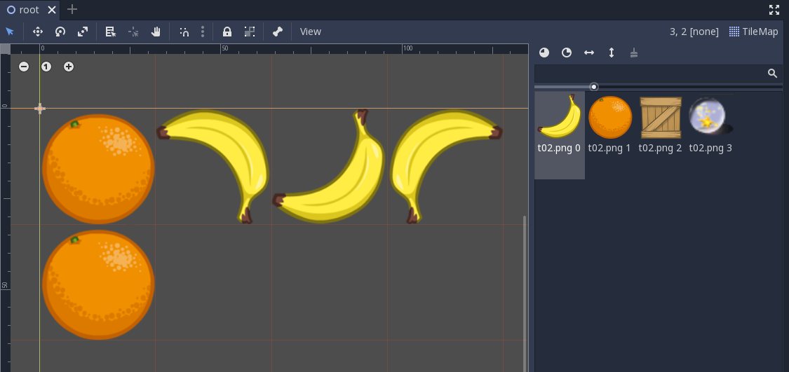

Godot Autotile Format
======================

1.  Autotile Example
--------------------

scene/autotiles

::

    [gd_scene load_steps=3 format=2]

    [ext_resource path="res://autoset.tres" type="TileSet" id=1]
    [ext_resource path="res://tset1.tres" type="TileSet" id=2]

    [node name="root" type="Node2D"]

    [node name="autotiles" type="TileMap" parent="."]
    tile_set = ExtResource( 1 )
    cell_size = Vector2( 32, 32 )
    format = 1
    tile_data = PoolIntArray( 0, 0, 0, 1, 0, 2, 65536, 0, 131072, 65537, 0, 131074, 131074, 0, 0, 131075, 0, 1, 131076, 0, 2, 196610, 0, 65536, 196611, 0, 65537, 196612, 0, 65538, 262146, 0, 131072, 262147, 0, 131073, 262148, 0, 131074 )

    [node name="TileMap" type="TileMap" parent="."]
    ...

tile_data
+++++++++

TODO

.. raw:: html

    <table class='reference'>
        <tr><th>Ndoe Data</th>
            <th>Data Formatted</th>
            <th>Details</th>
        </tr>
        <tr><td>tile_set = ExtResource( 2 )</td>
            <td>ExtResource(2) = tset1.tres</td>
            <td>Tileset</td>
        </tr>
        <tr><td>PoolIntArray[0:2] 
                0, 1, 0
            </td>
            <td>0: [x: 0, y: 0] - PosKey 
                1: [id: 1]      - Cell.struct.id 
                0: [auto-x: 0, auto-y: 0] 
                   -Cell.struct.autox/y
            </td>
            <td>Postion: x, y = 0, 0 
                Tileset's tile id: 1 
                Cell's auto tile id x, y = 0, 0
            </td>
        </tr>
        <tr><td>PoolIntArray[3:5] 
                1, 1073741824, 0 
            </td>
            <td>
                0: [x: 1, y: 0] - PosKey 
                1: [id: 0]      - Cell.struct.id 
                [fliph: 0, flipv: 1] 
                0: [auto-x: 0, auto-y: 0]
            </td>
            <td>
                Postion: x, y = 1, 0 
                Tileset's tile id = 0  ( 1073741824 = 4000 0000h ) 
                flip (x/h, y/v) = 0, 1 ( Why not 04h? ) 
            </td>
        </tr>
        <tr><td>... </td>
            <td>1610612736 65536</td>
            <td>6000 0000h: id, h, v = 0, 1, 1 ?  
                0001 0000h: pos(x, y) = 0, 1</td>
        </tr>
    </table>
..

2. File Format (.tres)
----------------------

2.1 Auto Tile Example
+++++++++++++++++++++

autotile.tres

::

    [gd_resource type="TileSet" load_steps=2 format=2]

    [ext_resource path="res://asserts/tileset.png" type="Texture" id=1]

    [resource]
    0/name = "tileset.png 0"
    0/texture = ExtResource( 1 )
    0/tex_offset = Vector2( 0, 0 )
    0/modulate = Color( 1, 1, 1, 1 )
    0/region = Rect2( 352, 96, 96, 96 )
    0/tile_mode = 1
    0/autotile/bitmask_mode = 0
    0/autotile/bitmask_flags = [ Vector2( 0, 0 ), 256, Vector2( 0, 1 ), 260, Vector2( 0, 2 ), 4, Vector2( 1, 0 ), 320, Vector2( 1, 1 ), 325, Vector2( 1, 2 ), 5, Vector2( 2, 0 ), 64, Vector2( 2, 1 ), 65, Vector2( 2, 2 ), 1 ]
    0/autotile/icon_coordinate = Vector2( 0, 0 )
    0/autotile/tile_size = Vector2( 32, 32 )
    0/autotile/spacing = 0
    0/autotile/occluder_map = [  ]
    0/autotile/navpoly_map = [  ]
    0/autotile/priority_map = [  ]
    0/autotile/z_index_map = [  ]
    0/occluder_offset = Vector2( 0, 0 )
    0/navigation_offset = Vector2( 0, 0 )
    0/shapes = [  ]
    0/z_index = 0

2.2 Tile Id
+++++++++++

...
