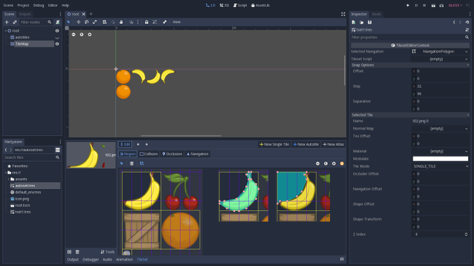

Godot TileSet(.tres) File Format
================================

TileSet Resource
----------------

TileSet file (.tres) composed from 2 major parts.

- Part I: referenced resources

::

    [gd_resource type="TileSet" load_steps=7 format=2]

    [ext_resource path="res://asserts/t02.png" type="Texture" id=1]

    [sub_resource type="NavigationPolygon" id=1]
    vertices = PoolVector2Array( 0, 0, 96, 0, 88, 8, 96, 24, 80, 64, 64, 80, 32, 96, 8, 96, 0, 104 )
    polygons = [ PoolIntArray( 0, 1, 2, 3, 4, 5, 6, 7, 8 ) ]
    [sub_resource type="ConvexPolygonShape2D" id=2]
    points = PoolVector2Array( 104, 0, 104, 24, 120, 40, 128, 56, 120, 88, 88, 120, 64, 128, 48, 128, 24, 120, 0, 104, 0, 96, 16, 96, 56, 88, 80, 64, 88, 48, 96, 24, 88, 8, 96, 0 )

The NavigationPolygon and ConvexPolygonShape2D are created with "collition" and
"navigation" command.

- Part II: tile definition

Tiles are defined in "id/porp-name" format, all in "[resource]" section

::

    [resource]
    0/name = "t02.png 0"
    0/texture = ExtResource( 1 )
    0/tex_offset = Vector2( 0, 0 )
    0/modulate = Color( 1, 1, 1, 1 )
    0/region = Rect2( 0, 0, 128, 128 )
    0/tile_mode = 0
    0/occluder_offset = Vector2( 0, 0 )
    0/navigation_offset = Vector2( 0, 0 )
    0/navigation = SubResource( 1 )
    0/shapes = [ {
    "autotile_coord": Vector2( 0, 0 ),
    "one_way": false,
    "one_way_margin": 1.0,
    "shape": SubResource( 2 ),
    "shape_transform": Transform2D( 1, 0, 0, 1, 0, 0 )
    } ]
    0/z_index = 0

Where *shapes* are defined as collision shape, and region must be the sprite area.
